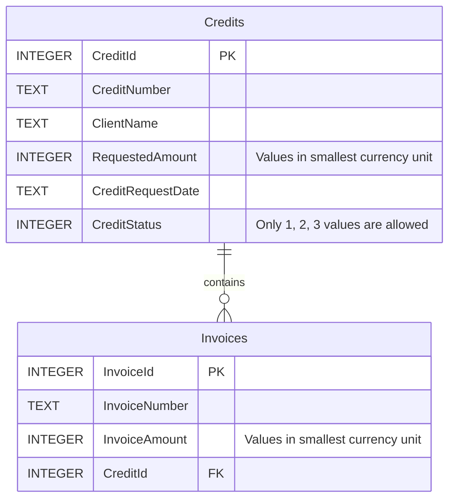

# Credits API application

## Overview
This is a C# API built using ASP.NET Core 8.0. The API provides endpoints for managing resources such as [Credits, Invoices, Statustic].

## Features
API has two endpoints
- GET http://localhost:5000/api/credits - returns a list of credits with a list of invoices for each credit.
- GET http://localhost:5000/api/credits/statistics - returns the total sum of credits with the "Paid" status, the total
               sum of credits with the "AwaitingPayment" status, and the percentage of each of these amounts in relation to the total 
               sum of all credits with the statuses "Paid" and "AwaitingPayment".


## DataBase structure


    
## Technologies
- ASP.NET Core
- Dapper
- SQLite

## Prerequisites
- .NET SDK 8.0.404

## Running the Application
1. Clone the repository:
   ```bash
   git clone https://github.com/your-repo/your-api.git